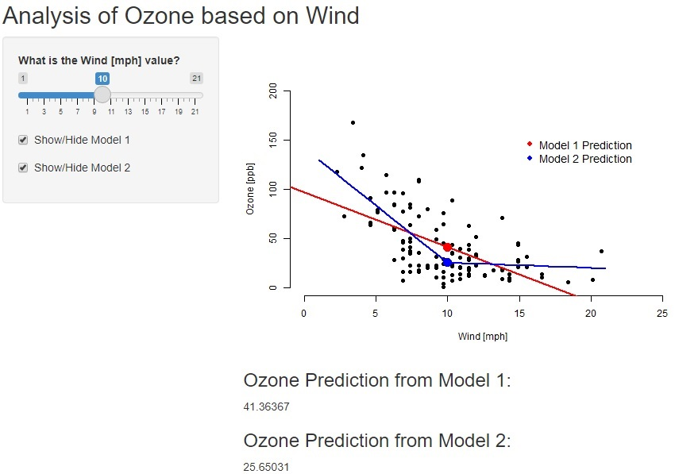

## About the project {.smaller}
This presentation is part of the Course Project for the Coursera Developing Data Products class. The peer assessed assignment has two parts. First, a Shiny application deployed on Rstudio's servers. Second, a reproducible pitch presentation about the application using Slidify or Rstudio Presenter. This presentation addresses the second part of the course project.

I constructed a shiny app for Analysis of Ozone impact from Wind.

The app can be found at:

https://damian77504.shinyapps.io/OzoneApp/

Source code for ui.R and server.R files are available on the GitHub:

https://github.com/Damian77504/DDP

## Ozone Analysis App Description

This app defines two linear regression models for Ozone prediction based on wind values. 

- First, by using slider, you can select wind [mph] value to see Ozone prediction results. 
There is a check box available as well, where you can show or hide the linear regression model trend. 

- The app shows graph with plot trends and points of the Ozone result based on the wind. Below the graph we get particular Ozone prediction results.

- Data Source: 
Ozone and Wind inputs are based on Airquality data set which is summarizing daily readings of the following air quality values for May 1, 1973 to September 30, 1973. This data set comes from R base package.


## Server calculation - Map
```{r echo = F, warning=FALSE}
library(shiny); library(leaflet)
```

```{r, size = 'tiny'}
shinyServer(function(input, output) {
    airquality$Wind1 <- ifelse(airquality$Wind - 10> 0, airquality$Wind - 10,0)
    model1 <- lm(Ozone ~ Wind, data = airquality)
    model2 <- lm(Ozone ~ Wind1 + Wind, data = airquality)
    
    model1pred <- reactive({WindInput <- input$sliderWind
        predict(model1, newdata = data.frame(Wind = WindInput)) })
    model2pred <- reactive({ WindInput <- input$sliderWind
        predict(model2, newdata = data.frame(Wind = WindInput,
        Wind1 = ifelse(WindInput - 10 > 0, WindInput - 10, 0))) })
    
    output$plot1 <- renderPlot({WindInput <- input$sliderWind
        plot(airquality$Wind, airquality$Ozone, xlab = "Wind [mph]",
             ylab = "Ozone [ppb]", bty = "n", pch = 16,
             xlim = c(0, 25), ylim = c(0, 200))
        if(input$showModel1){ abline(model1, col = "red", lwd = 2)}
        if(input$showModel2){model2lines <- predict(model2, newdata = data.frame
             (Wind = 1:21, Wind1 = ifelse(1:21 - 10 > 0, 1:21 - 10, 0)))
             lines(1:21, model2lines, col = "blue", lwd = 2)}
        legend(15, 160, c("Model 1 Prediction", "Model 2 Prediction"), pch = 16,
               col = c("red", "blue"), bty = "n", cex = 1.2)
        points(WindInput, model1pred(), col = "red", pch = 16, cex = 2)
        points(WindInput, model2pred(), col = "blue", pch = 16, cex = 2)
    })
    
    output$pred1 <- renderText({model1pred()})
    output$pred2 <- renderText({model2pred()})
}) 
```

## Visualization

{width=80% height=80%}